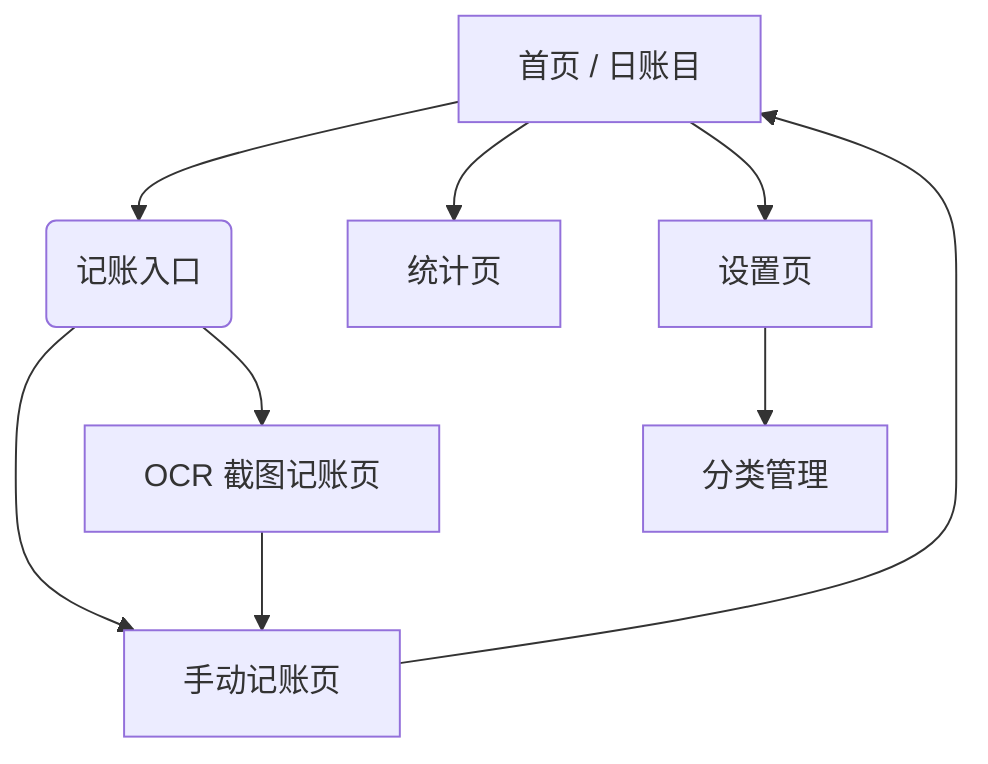

# PocketBook (口袋账本) 产品需求文档 (PRD)

> 版本：v1.0 (MVP)
> 日期：2026-03-23
> 状态：开发中

## 1. 产品概述

### 1.1 产品定义

PocketBook 是一款**本地优先、隐私至上**的个人记账应用，核心解决现有记账 App 广告多、启动慢、隐私泄露的痛点。通过**极速手动记账**与**OCR 截图智能识别**相结合，降低用户的记账阻力，帮助用户轻松养成记账习惯。

### 1.2 核心价值

- **极速**：秒开秒记，减少操作步骤。
- **隐私**：数据完全存储在本地 SQLite，不上传云端。
- **智能**：支持支付宝/微信账单截屏 OCR 识别，自动回填金额与商户。

### 1.3 用户画像

- **隐私敏感型用户**：不希望财务数据被第三方平台收集分析。
- **极简主义者**：厌倦了理财社区、贷款广告，只想要纯粹的工具。
- **懒人记账者**：经常忘记记账，希望通过截图后批量整理或辅助录入。

---

## 2. 功能范围 (MVP)

| ID   | 模块               | 功能点       | 优先级       | 说明                                                                    |
| :--- | :----------------- | :----------- | :----------- | :---------------------------------------------------------------------- |
| F-01 | **手动记账** | 快速录入收支 | **P0** | 核心流程，需支持数字键盘、分类选择、备注、日期                          |
| F-02 | **账目列表** | 首页流水展示 | **P0** | 按日分组展示，顶部显示当月结余/收支总额                                 |
| F-03 | **统计报表** | 收支统计图表 | **P0** | **MVP 仅支持日/月维度**。支持饼图（分类占比）与柱状图（收支对比） |
| F-04 | **OCR 记账** | 截图识别录入 | **P1** | 核心差异化功能。调用设备端 OCR 识别截图，回填表单供用户确认             |
| F-05 | **分类管理** | 自定义分类   | **P1** | 查看、新增、编辑、归档分类。支持停用不常用分类                          |
| F-06 | **数据管理** | 导出 CSV     | **P1** | 满足用户备份与迁移需求                                                  |
| F-07 | **基础设置** | 货币与偏好   | **P2** | 货币单位设置、关于页面                                                  |
| F-08 | **输入校验与反馈** | 记账交互状态 | **P0** | 保存按钮状态、错误提示、金额合法性校验、重复点击防抖                    |

> **V2 版本规划（暂不开发）**：借贷管理（独立台账）、年/周统计、资产账户管理、预算提醒。

---

## 3. 业务流程与页面详细定义

### 3.1 页面结构图 (Sitemap)

### 3.2 页面功能详解

#### 页面 1: 首页 / 日账目

- **顶部卡片**：
  - 展示当月总收入、总支出、当前结余。
  - 背景采用渐变色（主色调），数字大字展示。
- **流水列表**：
  - 按日期分组（如“今天”、“昨天”）。
  - 每行记录：分类图标（左）、类别名称+备注（中）、金额（右）。
  - 收入金额显绿色，支出金额显黑色/红色。
- **底部导航栏 (Tab Bar)**：
  - 首页 (Home)
  - 统计 (Stats)
  - **中间 FAB (记账/Scan)**：悬浮大按钮，点击弹出“手动记账”与“截图记账”选项。
  - 设置 (Settings)

#### 页面 2: 手动记账页 (`/add`)

- **类型切换**：顶部 Segmented Control 切换“支出 / 收入”。
- **金额输入**：自研数字键盘（含加减计算功能），大字显示金额。
- **分类选择**：
  - 网格布局（Grid）展示分类图标与名称。
  - 选中高亮。
- **扩展信息**：
  - 日期选择（默认今天）。
  - 备注输入框（单行文本）。
- **交互**：点击“保存”或者键盘“完成”键提交，返回首页并刷新列表。

**字段定义（MVP）**
- 交易类型：`expense` / `income`，默认 `expense`。
- 金额：`amount`，正数，最多 2 位小数，必填，`0` 不可提交。
- 一级分类：`categoryId`，必选。
- 二级分类：`subCategoryId`，有二级分类时必选。
- 日期：`transactionDate`，默认当天，可修改。
- 备注：`note`，可选，最长 50 字。

**关键交互状态（MVP）**
- 初始态：金额显示 `¥ 0.00`，保存按钮置灰。
- 可提交态：金额 > 0 且已选分类后，保存按钮高亮可点击。
- 提交中：保存按钮显示 loading，禁止重复点击（防抖 1 秒）。
- 成功态：Toast“已保存”，返回首页并滚动到对应日期分组。
- 失败态：Toast“保存失败，请重试”，保留当前输入内容。

**校验与错误提示（MVP）**
- 金额为空/为 0：提示“请输入有效金额”。
- 金额超过上限（单笔 > 999999.99）：提示“金额超出范围”。
- 备注超长：提示“备注最多 50 字”。
- 未选择分类：提示“请选择分类”。

**分类交互约束（MVP）**
- 一级分类采用网格，选中后高亮描边并展示二级分类面板。
 - 二级分类为最终可落账节点；若某一级分类不存在二级分类，则一级分类本身即为最终分类。
 - 若该一级分类存在二级分类，默认选中最近一次使用项；无历史则选第一个。
- “添加分类”入口进入分类管理页，新增后返回当前页并自动选中新分类。

#### 页面 3: 截图 OCR 记账页面 (`/scan`)

- **选图流程**：调用系统相册或相机。
- **识别状态**：显示“正在识别...”（Loading）。
- **结果确认页**：
  - 显示原图（可缩放查看）。
  - **自动回填表单**：
    - 金额：从 OCR 结果提取。
    - 备注：从商户名提取。
    - 日期：从截图时间提取。
    - 分类：基于关键词简单匹配（如涵盖“餐饮”则选餐饮），匹配不到默认为“其他”。
  - **人工修正**：用户必须点击确认或修改识别错误的信息。
- **保存**：逻辑同手动记账。

#### 页面 4: 统计页 (`/stats`)

- **维度切换**：顶部 Tab 切换 **“日” / “月”** (V2 增加 周/年)。
- **日期筛选**：支持左右滑动切换月份/日期。
- **收支概览**：显示该周期内的总收、总支、结余。
- **图表区域**：
  - **收支对比柱状图**：直观展示收支金额。
  - **分类占比饼图**：点击扇区可查看具体金额和百分比。
- **排行榜**：下方列出支出/收入最高的分类列表（Top 5）。

#### 页面 5: 分类管理页 (`/categories`)

- **列表展示**：
  - 分为"支出"和"收入"两个 Tab，顶部切换控件在页面中水平居中展示（**仅支持两级结构：一级分类 + 二级分类**）。
  - 列表支持拖拽排序（V2，MVP 可先按 `sortOrder` 排序）。
- **操作**：
  - **新增**：通过底部抽屉表单新增 1 个一级分类，并可同时新增多个二级分类，每项均可独立选择图标。
  - **编辑**：修改名称、图标、颜色。
  - **归档/停用**：MVP 不允许物理删除已使用的分类，只允许“停用”（列表不再显示，但统计数据保留）。

**页面布局要求（新增）**
- 页面头部保留标题与“新增”入口。
- “支出 / 收入”切换控件宽度固定，水平居中放置，不贴左侧列表边缘。
- 列表内容仍采用纵向卡片流，避免因整体居中导致信息拥挤；本次仅要求顶部收支切换区块居中展示。

**新增分类抽屉表单（新增）**
 - 触发方式：点击右上角"新增"按钮，从底部弹出抽屉表单。
 - 抽屉内容：
   - 一级分类基础信息：名称、类型（支出/收入）、**图标选择**、颜色。
   - 二级分类列表：支持动态新增多条二级分类（每条含名称与**图标选择**）。
 - 提交结果：一次提交可创建 `1 个一级分类 + N 个二级分类`。
 - 图标选择规则：
   - 图标选择器使用 Lucide Icons 全量图标库（当前共 **1685 个**图标，来源：[lucide.dev](https://lucide.dev/)）。
   - 选择器支持按关键词搜索图标名称，展示图标预览网格（每行 5-6 个），点击选中。
   - 一级分类和每条二级分类均可独立选择图标；图标可省略，省略时显示并使用默认 `folder` 图标。
   - 设计规范中需展示 Lucide 分类图标总览，并标注总数 1685 个。
 - 交互规则：
   - 未填写一级分类名称时不可保存。
   - 二级分类名称可为空；若为空则该条不创建。
   - 同类型下一级分类名称不可重复；同父节点下二级分类名称不可重复。
   - 保存成功后关闭抽屉，并在分类列表中定位到新建一级分类。

**分类管理闭环（本次补充重点）**
 - 一级分类字段：`id`、`type(expense/income)`、`name`、`icon`、`colorTokenBg`、`colorTokenText`、`sortOrder`、`enabled`、`isPreset`、`createdAt`、`updatedAt`。
 - 二级分类字段：`id`、`parentCategoryId`、`name`、`icon`、`sortOrder`、`enabled`。
 - 命名规则：同类型下一级分类名称唯一；同父节点下二级分类名称唯一；长度 1~12 字；去首尾空格后判重。
 - 预设规则：预设分类允许改排序与停用，不允许删除；可新增自定义分类。
 - 图标规范（新增）：
   - 分类图标来源：[Lucide Icons](https://lucide.dev/)，当前版本共 **1685 个**图标。
   - 图标以 Lucide 图标名字符串（如 `utensils`、`folder`）存储于字段 `icon`。
   - 新增分类时图标可省略；未指定时一级分类和二级分类统一使用 `folder` 作为默认图标。
   - 设计系统需收录 Lucide 图标分类总览（1685 个），并标注"默认分类图标 = `folder`"，作为表单与空态展示的统一基准。
   - 表单图标选择器显示所有 1685 个图标的网格预览，支持关键词搜索，选中后保存图标名。
- 停用规则：
  - 已被历史账目引用的分类仅允许停用，不允许删除。
  - 停用分类在记账页不可选，但历史账目与统计保持可见。
- 恢复规则：停用分类可恢复启用，恢复后回到原分组并按 `sortOrder` 展示。
- 排序规则：支持拖拽排序（MVP 可先按钮上下移动实现），持久化 `sortOrder`。
- 数据一致性：分类变更后，记账页分类网格与统计页分类名称/图标需即时刷新。

#### 页面 6: 设置页 (`/settings`)

- **通用**：货币符号设置（默认 ¥）。
- **数据**：
  - 导出数据为 CSV（调用系统分享 Sheet）。
  - 本地与隐私政策说明。
- **关于**：版本号、开发者信息。

---

## 4. 非功能性需求 (NFR)

### 4.1 数据隐私与安全

- **本地存储**：所有数据存储在设备本地 `SQLite` 数据库中。
- **无网络依赖**：应用必须在飞行模式下完全可用。
- **敏感权限**：仅在从相册选图时申请相册权限，不申请通讯录、位置等无关权限。

### 4.2 性能指标

- **冷启动时间**：< 1.5 秒（Expo 生产包标准）。
- **列表滚动**：1000 条数据以下无卡顿；超过 1000 条需分页加载。
- **OCR 耗时**：设备端识别如有模型加载过程，需有明确 Loading 提示，目标 < 3秒。

### 4.3 兼容性

- **iOS**：兼容 iOS 15+。
- **Android**：兼容 Android 10+。

---

## 5. 里程碑验收标准 (Milestone Checklist)

- [ ] **M1 骨架完成**：App 能跑通，数据库初始化成功。
- [ ] **M2 记账核心**：能完成一笔收支的手动录入，且首页列表能刷出该条数据。
- [ ] **M3 统计图表**：统计页能正确渲染饼图，数据与首页账目一致。
- [ ] **M4 OCR 流程**：能从相册选一张账单截图，识别出金额并填入输入框。
- [ ] **M5 数据导出**：点击导出能生成 CSV 并通过系统分享发送（如发送到微信或保存文件）。

---

## 6.1 手动记账页验收标准（新增）

- [ ] 默认进入支出模式，金额显示 `¥ 0.00`，保存按钮为禁用态。
- [ ] 输入合法金额并选择分类后，保存按钮可点击。
- [ ] 金额为 `0` 或空时点击保存，出现错误提示且不落库。
- [ ] 保存中不可重复提交，成功后返回首页可见新记录。
 - [ ] 一级分类切换后，二级分类面板内容同步变化。
 - [ ] 若存在二级分类，用户需选择到二级分类后方可完成保存。
 - [ ] 点击"添加分类"进入分类管理，新增后返回并自动选中新分类。

## 6.2 分类管理闭环验收标准（新增）

 - [ ] 可新增一级分类并从 Lucide 1685 个图标中选择图标、设置颜色和名称，新增后在记账页可见。
 - [ ] 可在一次抽屉表单提交中新增一个一级分类和多个二级分类（每条可独立选择图标）。
 - [ ] 图标选择器展示全量 1685 个 Lucide 图标网格，支持关键词搜索，选中后图标正常预览。
 - [ ] 未选择图标时自动使用默认 `folder` 图标，预览正常显示。
 - [ ] 同类型下一级分类重名禁止保存，并给出明确提示。
 - [ ] 同一父节点下二级分类重名时禁止保存，并给出明确提示。
- [ ] 已被账目使用的分类不可删除，仅可停用。
- [ ] 停用分类在记账页隐藏，但历史账目仍显示原分类信息。
- [ ] 恢复分类后在记账页重新可选。
- [ ] 调整排序后重启应用，顺序保持一致。
- [ ] 分类管理页顶部“支出 / 收入”切换控件在视觉上保持水平居中。

---

## 7. 预设分类体系

 > 图标库：[Lucide Icons](https://lucide.dev/)，当前版本共 **1685 个**图标，与 NativeWind 配色系统对齐。
 > 用户可在「分类管理」页面对以下预设进行增删改，通过图标选择器（全量 1685 图标）自定义图标与颜色。
 > 新增自定义分类未指定图标时，统一使用 Lucide `folder` 作为默认图标。

### 支出类目（18 项）

| 分类     | Lucide 图标         | 背景色                         | 示例场景                       |
| -------- | ------------------- | ------------------------------ | ------------------------------ |
| 餐饮     | `utensils`        | orange-100 / text-orange-500   | 早餐、午餐、晚餐、外卖、咖啡   |
| 购物     | `shopping-bag`    | blue-100 / text-blue-500       | 服饰、家居、数码配件、电商购物 |
| 交通     | `bus`             | green-100 / text-green-500     | 地铁/公交、打车、停车、加油    |
| 娱乐     | `gamepad-2`       | purple-100 / text-purple-500   | 电影、游戏、演出、KTV          |
| 居住     | `home`            | yellow-100 / text-yellow-600   | 房租、物业、水电维修、家装     |
| 医疗     | `heart-pulse`     | red-100 / text-red-500         | 诊疗、购药、体检、保险缴费     |
| 教育     | `graduation-cap`  | indigo-100 / text-indigo-500   | 学费、课程、资料、培训         |
| 旅行     | `plane`           | cyan-100 / text-cyan-500       | 机票、住宿、餐饮、景点门票     |
| 数码     | `smartphone`      | slate-100 / text-slate-500     | 手机配件、订阅、软件、维修     |
| 运动     | `dumbbell`        | emerald-100 / text-emerald-500 | 健身房、器材、课程、运动装备   |
| 宠物     | `cat`             | amber-100 / text-amber-600     | 饮食、医疗、洗护、用品         |
| 水电燃气 | `zap`             | yellow-100 / text-yellow-600   | 水费、电费、燃气费、取暖费     |
| 通讯网费 | `wifi`            | sky-100 / text-sky-500         | 宽带、手机流量、固话、数字服务 |
| 美容美发 | `scissors`        | pink-100 / text-pink-500       | 发型、护肤、美甲、美容课程     |
| 汽车养护 | `car`             | slate-100 / text-slate-500     | 保养、维修、加油、保险         |
| 书籍学习 | `book-open`       | indigo-100 / text-indigo-500   | 书籍、电子书、课程资料         |
| 亲子宝贝 | `baby`            | rose-100 / text-rose-500       | 尿布、奶粉、玩具、教育用品     |
| 其他     | `more-horizontal` | gray-100 / text-gray-500       | 临时支出、杂项、小额支出       |

### 收入类目（4 项）

| 分类 | Lucide 图标     | 背景色                       | 说明                 |
| ---- | --------------- | ---------------------------- | -------------------- |
| 工资 | `banknote`    | orange-100 / text-orange-500 | 月薪、年终奖、绩效   |
| 理财 | `trending-up` | red-100 / text-red-500       | 基金、股票、利息收益 |
| 兼职 | `briefcase`   | blue-100 / text-blue-500     | 外包、副业、临时工作 |
| 礼金 | `gift`        | pink-100 / text-pink-500     | 红包、人情收入、赠礼 |
